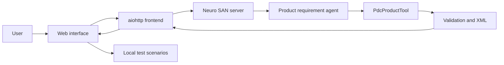

# Agentic Oracle BRM/PDC XML Generator

A Neuro SAN Studio application that converts natural-language telecom product requirements into structured Oracle BRM/PDC 15.2 pricing XML.

The project uses an LLM agent for requirement interpretation and a deterministic Python coded tool for specification validation, UUID generation, XML rendering and reference validation.

## Key features

- Natural-language product input
- Oracle PDC 15.2 reference profile
- One-time, recurring and usage charges
- Monetary charges and noncurrency grants
- Tiered usage pricing
- Optional bundled product offerings
- Deterministic UUID generation
- Safe XML escaping
- Internal rate-plan reference validation
- Optional catalog-profile validation
- Optional Oracle installation XSD validation
- Responsive XML viewer
- Browser-generated test scenarios
- No automatic XML persistence
- No automatic PDC import

## Architecture



### Responsibility separation

The Neuro SAN agent:

- Understands natural-language requirements
- Extracts a compact product specification
- Detects missing mandatory information
- Calls the coded tool once

The Python coded tool:

- Validates the specification
- Enforces offer-type rules
- Generates UUIDs
- Renders XML
- Escapes user-controlled values
- Validates rate-plan references
- Optionally validates a local catalog profile
- Optionally validates against an Oracle PDC 15.2 XSD

The browser:

- Displays formatted XML
- Displays validation status
- Generates applicable test scenarios locally
- Uses no additional LLM calls for test generation

## Repository structure

```text
.
├── apps/
│   └── pdc_product_generator/
│       ├── app.py
│       └── static/
│           ├── index.html
│           ├── styles.css
│           ├── test-scenarios.css
│           └── app.js
├── coded_tools/
│   └── pdc_product_generator/
│       └── pdc_product_tool.py
├── config/
│   ├── llm_config.hocon
│
├── registries/
│   ├── manifest.hocon
│   └── pdc_product_generator.hocon
├── tests/
├── .env.example
├── .gitignore
├── requirements.txt
└── README.md
```

## Supported scope

### Supported

- `ONE_TIME` charges
- `RECURRING` charges
- `USAGE` charges
- Monetary `CHARGE` impacts
- Noncurrency `GRANT` impacts
- Multiple components
- Usage tiers
- Charge offerings
- Optional bundled product offerings
- Tax configuration
- Validity configuration
- Recurring proration

### Not supported in version 1

- Discount offers
- Charge sharing
- Rollover
- Fold
- Remittance
- Selectors
- Packages
- Setup-component creation
- Automatic PDC import
- Database persistence

## Prerequisites

Install the following:

- Git
- Python 3.12 or newer
- A supported LLM-provider API key
- Git Bash on Windows

Oracle BRM/PDC is not required for basic XML generation.

A PDC environment or approved export is required for full catalog validation and controlled import testing.

## Installation

### 1. Clone the repository

```bash
git clone https://github.com/YOUR_GITHUB_USERNAME/pdc-product-generator.git
cd pdc-product-generator
```

### 2. Create a virtual environment

```bash
python -m venv .venv
```

### 3. Activate it in Git Bash

```bash
source .venv/Scripts/activate
```

### 4. Upgrade pip

```bash
python -m pip install --upgrade pip
```

### 5. Install the dependencies

```bash
pip install -r requirement.txt
```

### 6. Configure the LLM provider

Copy the environment example:

```bash
cp .env.example .env
```

Open `.env` and configure one supported provider:

```dotenv
OPENAI_API_KEY=your-real-key
```

Never commit `.env`.

### 7. Set the Neuro SAN paths

From the project root in Git Bash:

```bash
export AGENT_MANIFEST_FILE="$(pwd)/registries/manifest.hocon"
export AGENT_TOOL_PATH="$(pwd)/coded_tools"
export PYTHONPATH="$(pwd)/coded_tools;$(pwd)"
```

Windows Python uses a semicolon between `PYTHONPATH` entries.

### 8. Verify the environment

```bash
echo "$AGENT_MANIFEST_FILE"
echo "$AGENT_TOOL_PATH"
echo "$PYTHONPATH"
```

### 9. Verify the coded-tool import

```bash
python -c "from pdc_product_generator.pdc_product_tool import PdcProductTool; print(PdcProductTool.__name__)"
```

Expected result:

```text
PdcProductTool
```

### 10. Check the LLM configuration

```bash
ns check-llm-keys
```

```bash
ns check-config
```

### 11. Validate the agent network

```bash
ns validate registries/pdc_product_generator.hocon
```

## Running the system

The application requires two terminals.

### Terminal 1 — Start Neuro SAN

Enter the project:

```bash
cd /path/to/pdc-product-generator
```

Activate the environment:

```bash
source .venv/Scripts/activate
```

Set the paths:

```bash
export AGENT_MANIFEST_FILE="$(pwd)/registries/manifest.hocon"
export AGENT_TOOL_PATH="$(pwd)/coded_tools"
export PYTHONPATH="$(pwd)/coded_tools;$(pwd)"
```

Start the Neuro SAN HTTP server:

```bash
ns run --server-only
```

The Neuro SAN API should be available at:

```text
http://localhost:8080
```

Keep this terminal running.

### Terminal 2 — Start the frontend

Enter the same project:

```bash
cd /path/to/pdc-product-generator
```

Activate the environment:

```bash
source .venv/Scripts/activate
```

Configure the frontend:

```bash
export PYTHONPATH="$(pwd)/coded_tools;$(pwd)"
export NEURO_SAN_API_URL="http://localhost:8080"
export PDC_AGENT_NETWORK="pdc_product_generator"
export PDC_UI_HOST="127.0.0.1"
export PDC_UI_PORT="5002"
```

Start the frontend:

```bash
python -m apps.pdc_product_generator.app
```

Open:

```text
http://127.0.0.1:5002
```

## Direct chat mode

The agent can also run without the custom frontend:

```bash
ns chat pdc_product_generator
```

## Example prompt

```text
Generate Oracle BRM/PDC 15.2 pricing XML for a product named
Test_GB_Product with description "Test GB Product monthly postpaid
subscription charge".

Use price list Default and product specification
product_specification_demo. Create one recurring monetary charge named
Monthly_Fee for exactly 5 EUR per billing cycle.

Use event /event/billing/product/fee/cycle/cycle_forward_monthly,
RUM Occurrence, currency EUR, balance element 978, and unit NONE.

Use PRORATE_CHARGE for the first cycle, FULL_CHARGE for the last cycle,
and FULL_CHARGE for normal cycles. No tax applies. Do not create a
bundle, grant, usage charge, discount, package, or selector.
```

## Optional catalog validation

Copy the example profile:

```bash
cp config/pdc_catalog_profile.example.json config/pdc_catalog_profile.json
```

Replace the example values with an authorized catalog export.

Enable it:

```bash
export PDC_CATALOG_PROFILE="$(pwd)/config/pdc_catalog_profile.json"
```

Do not commit a production catalog profile.

## Optional Oracle XSD validation

Obtain the Oracle PDC 15.2 pricing XSD and its referenced XSD files from an authorized installation.

Set:

```bash
export PDC_PRICING_XSD_PATH="/authorized/path/to/PDC/apps/xsd/pricing-schema.xsd"
```

Do not commit Oracle installation XSD files.

## Validation result

The tool returns a validation result such as:

```json
{
  "profile": "Oracle PDC 15.2",
  "reference_validated": true,
  "documentation_rules_validated": true,
  "service_event_map_validated": false,
  "catalog_validated": false,
  "xsd_validated": false,
  "import_tested": false,
  "import_certified": false,
  "errors": [],
  "warnings": []
}
```

`reference_validated: true` does not mean that the XML has been imported into Oracle PDC.

## Testing

The browser automatically performs checks including:

- XML well-formedness
- Pricing root element
- Namespace
- Object dependency order
- UUID format and uniqueness
- Rate-plan ID resolution
- Rate-plan name resolution
- Offering external/internal ID consistency
- Duplicate pricing names
- XML-special-character handling

The UI also displays manual environment scenarios for:

- Product-specification existence
- Service-event-RUM mapping
- Balance-element existence
- Oracle XSD validation
- PDC import
- BRM runtime rating

Browser-side test generation uses no additional LLM calls.

## Troubleshooting

### `ModuleNotFoundError: pdc_product_generator`

Ensure `coded_tools` is first in `PYTHONPATH`:

```bash
export PYTHONPATH="$(pwd)/coded_tools;$(pwd)"
```

Verify:

```bash
python -c "import pdc_product_generator; print(pdc_product_generator.__file__)"
```

### Agent does not appear

Check:

```bash
echo "$AGENT_MANIFEST_FILE"
cat registries/manifest.hocon
```

The manifest must contain:

```hocon
{
    "pdc_product_generator.hocon": true
}
```

Restart Neuro SAN after changing Python coded tools.

### Frontend cannot reach Neuro SAN

Confirm Terminal 1 is running and verify:

```bash
curl http://localhost:8080/api/v1/list
```

Check the frontend setting:

```bash
echo "$NEURO_SAN_API_URL"
```

### HOCON parsing error

Validate:

```bash
ns validate registries/pdc_product_generator.hocon
```

Ensure the `include` statement is inside the root HOCON braces.

## Security

- Never commit `.env`
- Never commit API keys
- Never commit production catalog exports
- Never commit Oracle installation XSDs
- Never claim import certification without a controlled import test
- Review generated XML before using it in an Oracle environment

## Technology stack

- Neuro SAN Studio
- HOCON
- Python
- `xml.etree.ElementTree`
- `aiohttp`
- HTML5
- CSS
- JavaScript
- Optional `lxml` for XSD validation
